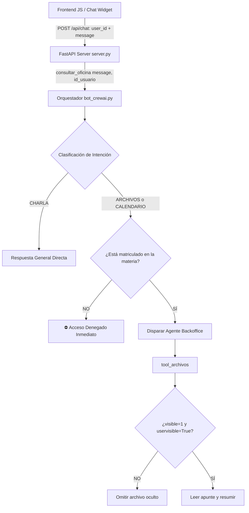

# Módulo de Control de Permisos y Protección de Contenidos en Moodle

- **Responsable**: Backend 1 / El Psicólogo de la IA
- **Rama**: `Esteban`
- **Archivos afectados**:
  - [`skills/utils.py`](../skills/utils.py)
  - [`skills/archivos.py`](../skills/archivos.py)
  - [`skills/calendario.py`](../skills/calendario.py)
  - [`bot_crewai.py`](../bot_crewai.py)
  - [`server.py`](../server.py)
- **Estado**: ✅ Implementado y Verificado (13/13 pruebas exitosas)

---

## 🎯 Objetivo del Módulo

Garantizar que el Asistente Virtual Académico cumpla rigurosamente con los permisos y privacidad institucional de Moodle:
1. **Control de Matrícula**: Un alumno logueado (`user_id`) no puede acceder ni consultar apuntes, temas o fechas de materias en las que no esté matriculado.
2. **Protección de Contenidos Ocultos**: Dentro de una materia permitida, la IA tiene prohibido leer, extraer o resumir archivos ubicados en secciones o módulos marcados como ocultos (`visible == 0` o `uservisible == False`) en Moodle.
3. **Propagación de Identidad**: El identificador de usuario (`user_id`) enviado desde el frontend se propaga a lo largo de toda la cadena de backend y herramientas.

---

## ⚙️ Arquitectura y Modificaciones Técnicas



### 1. [`skills/utils.py`](../skills/utils.py)
- Se incorporó la función `obtener_cursos_matriculados(id_usuario)` consumiendo el endpoint oficial de Moodle Web Services: `core_enrol_get_users_courses`.
- Se implementó `verificar_acceso_materia(id_usuario, nombre_buscado)` que valida si el curso solicitado figura en las inscripciones del alumno, distinguiendo si la materia existe globalmente en la institución o si el nombre no fue encontrado.

### 2. [`skills/archivos.py`](../skills/archivos.py)
- Se añadió un filtro estricto de dos niveles sobre el árbol de secciones y módulos (`core_course_get_contents`):
  - **Filtro de Sección**: Omite secciones donde `not seccion.get('uservisible', True) or seccion.get('visible', 1) == 0`.
  - **Filtro de Módulo/Recurso**: Omite módulos donde `not modulo.get('uservisible', True) or modulo.get('visible', 1) == 0`.
- Si todo el contenido de una materia está oculto, la herramienta responde de manera segura sin filtrar información sensible: `"No hay archivos o contenidos visibles en la materia..."`.

### 3. [`bot_crewai.py`](../bot_crewai.py)
- En `consultar_oficina(mensaje_alumno, id_usuario)`:
  - Antes de invocar a los agentes de backoffice (`agente_archivos` o `agente_calendario`), se ejecuta `verificar_acceso_materia(id_usuario, materia)`.
  - Si el alumno no está matriculado, se corta el flujo de inmediato devolviendo un mensaje pedagógico y seguro, evitando el gasto de llamadas al LLM y protegiendo los datos del curso.

### 4. [`server.py`](../server.py)
- Se vinculó el campo `request.user_id` del modelo `ChatRequest` en la llamada a `consultar_oficina(request.message, id_usuario=request.user_id)`.

---

## 🧪 Pruebas Automatizadas

La suite [`tests/test_permisos_moodle.py`](../tests/test_permisos_moodle.py) valida de forma exhaustiva los escenarios:

### Ejecución de Pruebas
```bash
python -m unittest discover tests -v
```

### Matriz de Resultados (13 de 13 Pruebas Exitosas)
| Archivo de Prueba | Caso de Prueba | Resultado |
| :--- | :--- | :---: |
| `test_permisos_moodle.py` | `test_usuario_no_matriculado_bloqueado_en_archivos` | ✅ PASÓ |
| `test_permisos_moodle.py` | `test_usuario_no_matriculado_bloqueado_en_calendario` | ✅ PASÓ |
| `test_permisos_moodle.py` | `test_usuario_matriculado_acceso_permitido` | ✅ PASÓ |
| `test_permisos_moodle.py` | `test_filtro_ignora_secciones_y_modulos_ocultos` | ✅ PASÓ |
| `test_permisos_moodle.py` | `test_todos_contenidos_ocultos_retorna_aviso` | ✅ PASÓ |
| `test_permisos_moodle.py` | `test_chat_endpoint_pasa_user_id` | ✅ PASÓ |
| `test_modulo_4.py` | 7 pruebas del módulo anti-alucinaciones | ✅ PASÓ |
